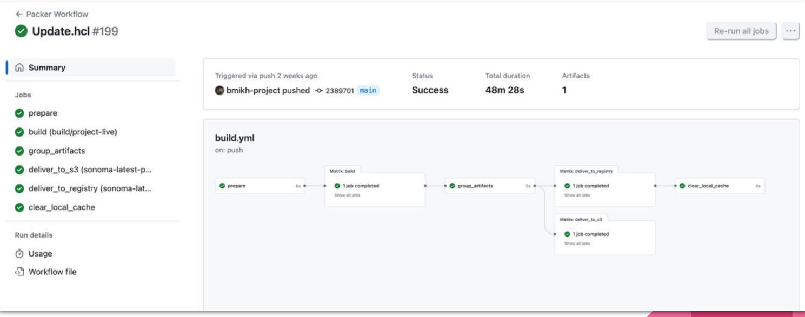
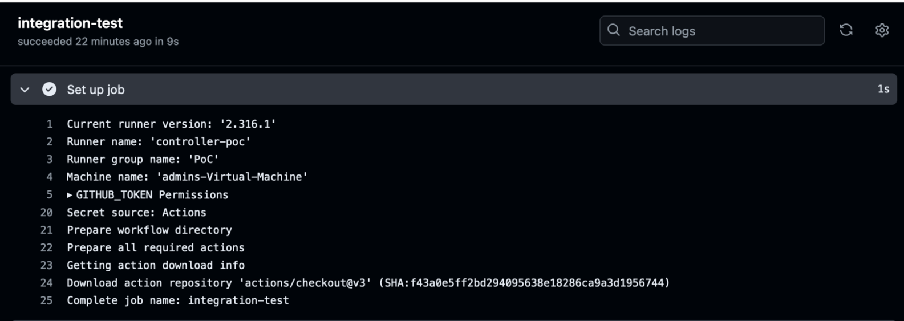
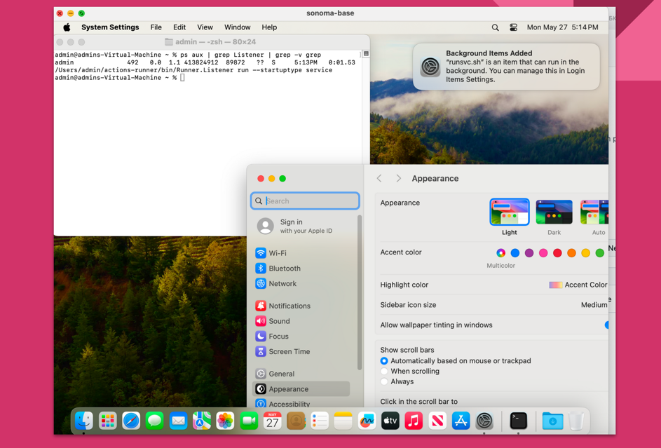
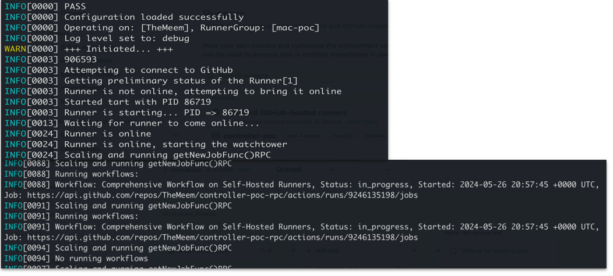

# Аналіз ефективності та оптимізація процесу десеріалізації в гетерогенних системах

This project aims to improve the efficiency of deserialization processes in heterogeneous systems by optimizing data transmission and resource utilization.

---

## Installation Requirements

⚠️ **Warning**: This project is **designed exclusively for Apple Silicon devices**. Other systems or architectures are not supported.  
The project has been tested on devices listed in [Apple Silicon Supported Macs](https://support.apple.com/pl-pl/111894). **Apple Silicon is mandatory** for proper functionality.

### System Requirements:
- **Operating System**: macOS 15.1 (24B83) or later.
- **GitHub Organization**: A [GitHub](https://github.com) account with organization privileges is required to clone and run the project.

### Required Tools:
1. **Go**: Install version `go1.23.3 darwin/arm64` from [here](https://go.dev/doc/install).
2. **Python**: Install version `3.12.2` or later from [here](https://www.python.org/downloads/).
3. **PiP**: Install version `24` or later from [here](https://pypi.org/project/pip/).
4. **Xcode**: Install version `14` or later, including Command Line Tools, from [here](https://developer.apple.com/xcode/).
5. **XCODES**: Use [Xcodes](https://github.com/XcodesOrg/xcodes) to manage Xcode versions if needed for publishing.
6. **Homebrew**: Install [Homebrew](https://brew.sh) to manage dependencies.
7. **Virtualizer**: Use an ARM-compatible virtualizer like [Tart](https://github.com/cirruslabs/tart).
8. **Packer**: Install [Packer](https://www.packer.io/) to build images for the virtualizer.

---

## Project Structure

## Project Structure

```plaintext
📂 Project Root
├── 📂 analisis                # Independent research and analytical reports related to the project
├── 📂 mac-vm-build            # Scripts and configurations for building macOS-based virtual machines
├── 📂 src                     # Core source code for the project
├── 📂 tests                   # Unit and integration tests to verify functionality
├── 📂 screenshots             # Screenshots showcasing the project in action
├── LICENSE                    # License under which this project is distributed
├── README.md                  # Project documentation and usage instructions
└── requirements.txt           # Python dependencies required for the project
```
---

## Screenshots

Here are some examples of the project in action:






---

## Usage

To run the project, follow these steps:

1. Clone the repository:
    ```bash
    git clone https://github.com/yourusername/project-name.git
    cd project-name
    ```

2. Install dependencies using Homebrew and PiP:
    ```bash
    brew install [list your dependencies here]
    pip install -r requirements.txt
    ```

3. Build and run the virtual environment using `Packer` and your virtualizer:
    ```bash
    packer build mac-vm-build/config.pkr.hcl
    ```
4. Run controller via `src` (go binary)
